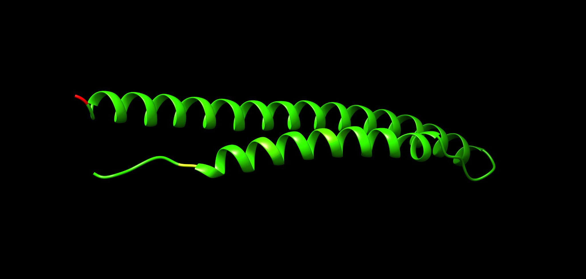
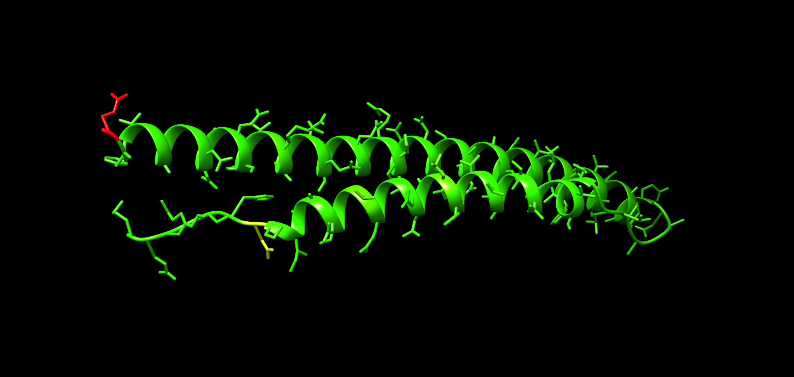
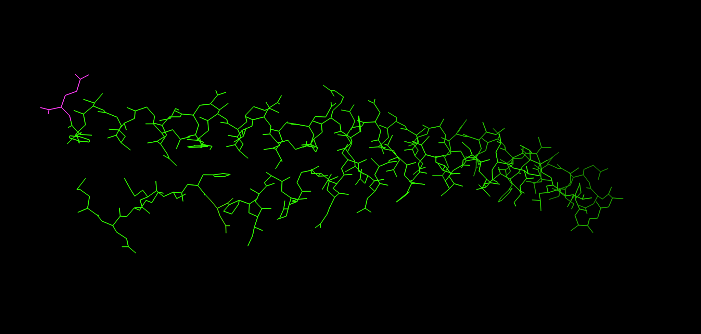
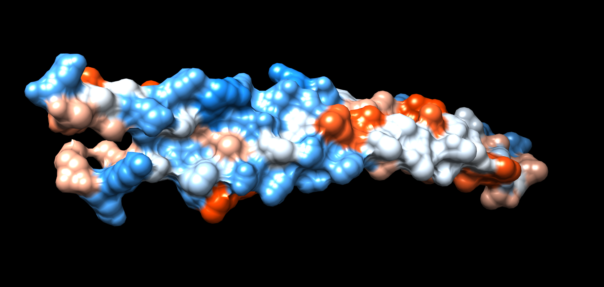

Overview
========

In this module you will learn how to:

- Retrieve AlphaFold protein structures
- Prepare residue-level SNP attribute files for Chimera
- Map SNP counts onto a 3D structure in UCSF Chimera
- Interpret mutation density in structural context

We use the _Mycobacterium tuberculosis_ protein Rv3872 (PE35) as a worked example.

Learning goals
--------------

By the end you should be able to:

- Generate a valid Chimera attribute file (.defattr) from a residue-level SNP table
- Load the attribute into Chimera and color a structure by SNP burden
- Compare cartoons, side chains and surfaces to localize hotspots
- Combine SNP burden with AlphaFold confidence to avoid over-interpreting low-confidence regions

Inputs for this practical
-------------------------

AlphaFold model (example):

- [AF-P9WIG7-F1-model_v2.pdb](./AF-P9WIG7-F1-model_v2.pdb)

Example residue-level SNP count table (text):

- [Rv3872_SNPcount.txt](Rv3872_SNPcount.txt)

An example of a problematic CSV format (comma separated):

- [NOTgoodComma.csv](NOTgoodComma.csv)

Background
==========

Mapping SNPs onto protein structures can help you identify mutation hotspots, assess structural clustering and generate mechanistic hypotheses. It is most informative when combined with: variant effect type, lineage context, phenotypes such as MIC, and structural confidence from AlphaFold.

This practical focuses on the mechanics of getting from a residue-level SNP table to a useful structural visualization.

Step 1: Obtain a structure
==========================

1. Open AlphaFold DB
2. Search for the UniProt ID of the protein of interest (for Rv3872: P9WIG7)
3. Download the structure, ideally as mmCIF. PDB also works.

If you already have an AlphaFold PDB file, you can proceed directly.

Figure examples below show the same structure in different representations you will recreate in Chimera.

{fig-alt="Rv3872 cartoon backbone representation"}

Step 2: Prepare an attribute file for Chimera
==============================================

Chimera can color residues by a custom attribute. The attribute is supplied as a plain text file with a required header and one line per residue.

A minimal .defattr structure is:

```text
attribute: nsSNPs
match mode: 1-to-1
recipient: residues
    :1    0
    :2    0
    :3    0
```

Key rules to avoid failure
--------------------------

- Use tabs between the residue selector and the value
- Residue numbering must match the model residue numbering
- Remove STOP codon or any non-residue entries
- Do not use commas as separators

::: {.callout-tip collapse="true"}
Tip: validating a .defattr file quickly

Open the file in a plain text editor and confirm:

- The first three header lines exist exactly once
- Data lines start with a colon, then a residue number
- Columns are separated by a tab, not spaces or commas
:::

Automating attribute creation
-----------------------------

You can generate a .defattr from a two-column table residue,count. Below are two options: a small Python script and an awk one-liner. Both avoid manual spreadsheet editing.

Option A: Python script
^^^^^^^^^^^^^^^^^^^^^^^

Save as make_defattr.py and run from the command line.

```python
import argparse
import csv
import sys

def read_table(path, delimiter):
    rows = []
    with open(path, "r", newline="", encoding="utf-8") as handle:
        reader = csv.reader(handle, delimiter=delimiter)
        for row in reader:
            if not row:
                continue
            if len(row) < 2:
                continue
            a, b = row[0].strip(), row[1].strip()
            if not a or not b:
                continue
            if not a.isdigit():
                continue
            try:
                val = float(b)
            except ValueError:
                continue
            rows.append((int(a), val))
    return rows

def main():
    ap = argparse.ArgumentParser()
    ap.add_argument("--infile", required=True)
    ap.add_argument("--outfile", required=True)
    ap.add_argument("--attribute", default="nsSNPs")
    ap.add_argument("--delimiter", default="\t")
    ap.add_argument("--drop-residues", default="")
    args = ap.parse_args()

    delimiter = args.delimiter.encode("utf-8").decode("unicode_escape")
    rows = read_table(args.infile, delimiter)

    drop = set()
    if args.drop_residues.strip():
        for x in args.drop_residues.split(","):
            x = x.strip()
            if x.isdigit():
                drop.add(int(x))

    rows = [(r, v) for r, v in rows if r not in drop]
    rows.sort(key=lambda t: t[0])

    with open(args.outfile, "w", encoding="utf-8") as out:
        out.write(f"attribute: {args.attribute}\n")
        out.write("match mode: 1-to-1\n")
        out.write("recipient: residues\n")
        for r, v in rows:
            if v.is_integer():
                vtxt = str(int(v))
            else:
                vtxt = str(v)
            out.write(f"\t:{r}\t{vtxt}\n")

if __name__ == "__main__":
    main()
```

Example runs:

```text
python make_defattr.py --infile Rv3872_SNPcount_two_col.tsv --outfile Rv3872_nsSNPs.defattr
python make_defattr.py --infile NOTgoodComma.csv --delimiter "," --outfile Rv3872_nsSNPs.defattr
```

Option B: awk one-liner
^^^^^^^^^^^^^^^^^^^^^^^

Works when your input is already two columns residue tab count.

```text
awk 'BEGIN{print "attribute: nsSNPs"; print "match mode: 1-to-1"; print "recipient: residues"} {if ($1 ~ /^[0-9]+$/) print "\t:"$1"\t"$2}' input.tsv > Rv3872_nsSNPs.defattr
```

Step 3: Open the model in Chimera
=================================

Install and open UCSF Chimera.

- File → Open → select your model file (.pdb or .cif)

Recommended initial view setup:

- Actions → Ribbon → show
- Presets → Interactive 1 (optional)

Step 4: Load the residue attribute and color the structure
==========================================================

Define the attribute
--------------------

- Tools → Structure Analysis → Define Attribute
- Load your .defattr file
- Confirm recipient is residues and the attribute name is nsSNPs

Render by attribute
-------------------

- Tools → Structure Analysis → Render by Attribute
- Attribute: nsSNPs
- Recipient: residues
- Choose a color ramp and adjust thresholds

You should now see high-burden residues highlighted.

Example representation with side chains shown:

{fig-alt="Rv3872 cartoon with side chains"}

Step 5: Switch representations to interpret the pattern
=======================================================

Cartoon plus side chains
------------------------

Use this to see whether hotspots fall on particular helices or loops.

- Actions → Atoms/Bonds → show
- Actions → Atoms/Bonds → stick (optional for emphasis)

Wire or stick emphasis
----------------------

This view is useful when you want the mutation pattern to stand out from the backbone.

{fig-alt="Rv3872 wire representation emphasizing side chains"}

Surface view
------------

Surfaces help decide whether hotspots are likely exposed.

- Actions → Surface → show
- Tools → Depiction → Surface (optional refinements)

Electrostatics are often inspected alongside SNP burden when you suspect interaction interfaces.

{fig-alt="Rv3872 electrostatic surface example"}

Step 6: Add AlphaFold confidence as a sanity check
==================================================

AlphaFold structures include per-residue confidence (pLDDT). A common pitfall is to interpret clustering in regions with low confidence, often flexible or disordered.

Practical guidance:

- Treat high SNP density in low-confidence segments as weak structural evidence
- Prefer conclusions from regions with consistently high confidence

In Chimera you can inspect confidence if it is stored as a B-factor like field in your model, depending on file type. If not available, obtain confidence from the AlphaFold download and map it as a second attribute using the same mechanism as for nsSNPs.

Exercises
=========

::: {.callout-note}
### Exercise 1: basic mapping

Load the Rv3872 structure, load your nsSNPs attribute and color the structure by SNP count.

Answer briefly:

- Which residue index has the highest SNP count in your table
- Is it located in a helix or in a loop
- Does it appear surface exposed in the surface view
:::

::: {.callout-note}
### Exercise 2: thresholding and interpretability

Adjust the color thresholds so that:

- 0 to 5 is low burden
- 5 to 20 is medium burden
- greater than 20 is high burden

Does the hotspot pattern become easier to interpret or does it become misleading
:::

::: {.callout-note}
### Exercise 3: confidence-aware interpretation

Overlay or separately color by confidence and decide which parts of the protein you trust structurally.

List one region you would prioritize for follow-up and one region you would treat cautiously.
:::

Common troubleshooting
======================

Attribute file loads but nothing changes:

- Check that residue numbering matches the model
- Confirm match mode 1-to-1
- Confirm recipient residues
- Confirm tabs are present

Chimera errors on load:

- Remove non-residue lines, especially STOP codon entries
- Remove commas and ensure tab separation

Hotspot appears in an unstructured tail:

- Check AlphaFold confidence and avoid over-interpreting low-confidence segments

Further reading and resources
=============================

- Chimera tutorials: [https://www.cgl.ucsf.edu/chimera/tutorials.html](https://www.cgl.ucsf.edu/chimera/tutorials.html)
- Chimera getting started: [https://www.cgl.ucsf.edu/Outreach/Tutorials/GettingStarted.html](https://www.cgl.ucsf.edu/Outreach/Tutorials/GettingStarted.html)
- Protein structure analysis course: [https://elearning.vib.be/courses/protein-structure-analysis/lessons/introduction/topic/sequences-and-structures/](https://elearning.vib.be/courses/protein-structure-analysis/lessons/introduction/topic/sequences-and-structures/)
