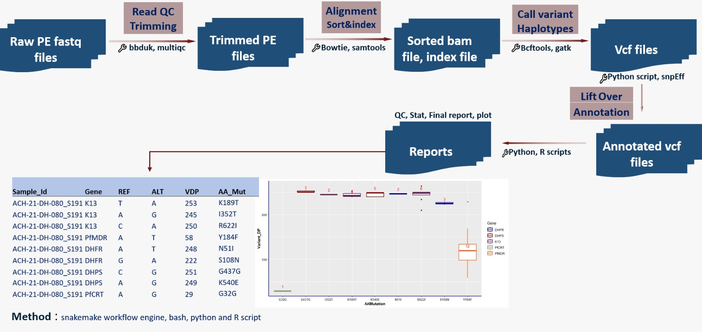

# Automating Pipelines: RiFA – Resistance in *Plasmodium falciparum* Amplicon Sequences

**RiFA** (Resistance in Falciparum Amplicon) is a bioinformatics workflow designed to detect **drug resistance mutations** in targeted amplicon sequencing data from *Plasmodium falciparum*, the primary cause of severe malaria. It focuses on key genes linked to resistance against major antimalarial drugs such as artemisinin, chloroquine, sulfadoxine-pyrimethamine, and others.

This pipeline automates processing of amplicon reads → quality control → alignment → variant calling → resistance mutation annotation — making it efficient, reproducible, and scalable for molecular surveillance of antimalarial resistance.

## What Are Workflow Pipelines?

A **workflow pipeline** is a sequence of automated computational steps that process and analyze data in a structured, reproducible way.

### Why Pipelines Matter in Bioinformatics

- Efficiently handle **large datasets** (hundreds/thousands of samples)
- Minimize **manual errors** and inconsistencies
- Enable **reproducible research** — run the same analysis tomorrow or years later with identical results
- Automate **complex multi-step analyses** that would otherwise be time-consuming

### Classic Amplicon Sequencing Pipeline Example


## Popular Workflow Managers / Engines

- **Snakemake** — Python-based, rule-based, great for dependency management
- **Nextflow** — DSL-based, highly portable (local, HPC, cloud)

Workflow managers help you:

- Define clear **steps** and their **dependencies**
- Execute tasks automatically in the **correct order**
- **Parallelize** jobs across cores / nodes to accelerate analysis
- Handle **software environments** via Conda, Docker, or Singularity

### Where Can Pipelines Run?

- Personal laptop / workstation
- **High-Performance Computing** (HPC) clusters
- Cloud platforms (AWS Batch, Google Cloud Life Sciences, Azure Batch)

## Key Benefits of Workflow Pipelines

**Efficiency**  
Automates repetitive tasks → frees researchers for interpretation rather than clicking.

**Reproducibility**  
Version-controlled pipelines ensure others (or future you) can reproduce results exactly.

**Scalability**  
Process 10 samples or 10,000 samples with minimal changes.

**Collaboration & Sharing**  
Share via **GitHub**, **GitLab**, or **Zenodo** → colleagues worldwide can reuse, adapt, and cite your work.

## Hands-on Exercise: Run the RiFA Pipeline

In this exercise, you will use the **RiFA pipeline** to identify drug resistance mutations in *Plasmodium falciparum* amplicon sequences.

### Target Genes in RiFA

RiFA focuses on key resistance-associated loci:

- *pfcrt* — chloroquine resistance transporter
- *pfmdr1* — multidrug resistance protein 1
- *pfk13* (kelch13) — artemisinin partial resistance
- *pfdhfr* — pyrimethamine resistance
- *pfdhps* — sulfadoxine resistance
- *cytb* — atovaquone resistance (cytochrome b)

### Pipeline overview 



### Getting Started

1. Visit the official repository:  
   **[https://github.com/BettyAC/RiFA](https://github.com/BettyAC/RiFA)**  
   → Read the full **README**, installation guide, and example usage.

2. Clone the repository:

   ```bash
   git clone https://github.com/BettyAC/RiFA.git
   cd RiFA
   ```

3. Create and run the environment

    ```bash
    # Create and activate the environment (file name may vary — check README)
    conda env create -f environment.yml
    conda activate rifa-env
    ```

4. Run the pipeline

    ```bash
    snakemake --use-conda --cores 8 --rerun-incomplete
    ```

Expected Outputs:

- Annotated variant table (CSV/TSV) with resistance mutations, allele frequencies, and quality metrics
- MultiQC report summarizing QC and coverage
- Visual summaries (coverage plots, mutation heatmaps, frequency bar charts)
- Resistance profile summary per sample

Note: This pipeline is part of efforts like the Ethiopian Malaria Genomics Network (EMAGEN) and similar surveillance projects. Always check the repository for the latest version, example datasets, and any required reference files.
